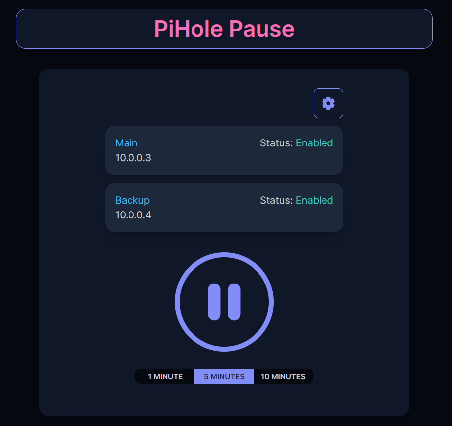

#PiHole Pause

### Description

Pause multiple self-hosted pi-hole instances with one press of a button.

### Installation

Requires docker and docker compose.

1. clone repo
2. check docker-compose.yaml and verify port and volume location for your use case
3. run `docker compose up -d`
4. connect to instance and add pi-hole's by IP address

### Questions?

Open an issue if anything comes up 👍
